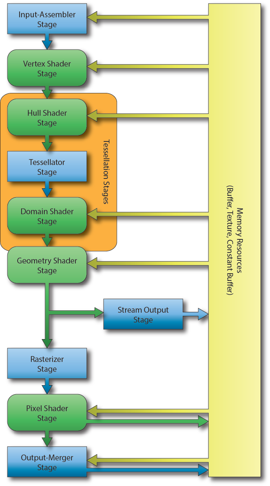

PipeLine


### Direct常用概念
DirectX图形基础设施（DirectX Graphics Infrastructure，*DXGI*）
描述符：
RTV（渲染目标缓冲区描述符）、DSV（深度模板缓冲区描述符）、CBV_SRV_UAV（常量缓冲区描述符、着色器资源缓冲描述符和随机访问缓冲描述符）

#### CPU GPU Synchronization

为了让应用程序获得更好的性能，需要在 CPU 与 GPU 之间采取一种平衡，尽可能让两者拥有更少的空闲时间，并达到更好的并行性。

既然是并行工作，如果没有特殊的规范和限制，那是一定会出错的。为了解决这种问题，引用了 ID3D12Fence 接口。原理是设置一个隔离（Fence）点， CPU 等待 GPU 处理完所有在隔离点之前的指令，这个过程叫做刷新指令队列（flushing the command queue）。

```
HRESULT ID3D12Device::CreateFence(
    UINT64 InitialValue,
    D3D12_FENCE_FLAGS Flags,
    REFIID riid,
    void **ppFence
);

// Example
ThrowIfFailed(md3dDevice->CreateFence(0, D3D12_FENCE_FLAG_NONE, IID_PPV_ARGS(&mFence)));
```

```
UINT64 mCurrentFence = 0;
void D3DApp::FlushCommandQueue()
{
    // Advance the fence value to mark commands up to this fence point.
    mCurrentFence++;

    // Add an instruction to the command queue to set a new fence point.
    // Because we are on the GPU timeline, the new fence point won’t be
    // set until the GPU finishes processing all the commands prior to
    // this Signal().
    ThrowIfFailed(mCommandQueue->Signal(mFence.Get(), mCurrentFence));

    // Wait until the GPU has completed commands up to this fence point.
    if(mFence->GetCompletedValue() < mCurrentFence)
    {
        HANDLE eventHandle = CreateEventEx(nullptr, false, false, EVENT_ALL_ACCESS);

        // Fire event when GPU hits current fence.
        ThrowIfFailed(mFence->SetEventOnCompletion(mCurrentFence, eventHandle));

        // Wait until the GPU hits current fence event is fired.
        WaitForSingleObject(eventHandle, INFINITE);

        CloseHandle(eventHandle);
    }
}
```


#### CommandQueue

在 Direct3D 12 中，指令队列的是由 ID3D12CommandQueue接口表示。若要使用此函数，需要填充 D3D12_COMMAND_QUEUE_DESC结构体，然后调用 ID3D12Device::CreateCommandQueue 


```
Microsoft::WRL::ComPtr<ID3D12CommandQueue> mCommandQueue;

D3D12_COMMAND_QUEUE_DESC queueDesc = {};
queueDesc.Type = D3D12_COMMAND_LIST_TYPE_DIRECT;
queueDesc.Flags = D3D12_COMMAND_QUEUE_FLAG_NONE;

ThrowIfFailed(
    md3dDevice->CreateCommandQueue(
        &queueDesc, 
        IID_PPV_ARGS(&mCommandQueue)
    )
);
```

其中 IID_PPV_ARGS宏用来返回 COM 接口的 ID。

```#define IID_PPV_ARGS(ppType) __uuidof(**(ppType)), IID_PPV_ARGS_Helper(ppType)``` 

另外一个重要的函数是 ExecuteCommandLists，它用来将指令列表中的指令扔进指令队列中：

```
void ID3D12CommandQueue::ExecuteCommandLists(
    // Number of commands lists in the array
    UINT Count,
    // Pointer to the first element in an array of command lists
    ID3D12CommandList *const *ppCommandLists
);
```

```
// mCommandList pointer to ID3D12CommandList

// adds commands that set the viewport
mCommandList->RSSetViewports(1, &mScreenViewport);

//clear the render target view
mCommandList->ClearRenderTargetView(
    mBackBufferView,
    Colors::LightSteelBlue, 
    0, 
    nullptr
);

// issue a draw
mCommandList->DrawIndexedInstanced(36, 1, 0, 0, 0);
```

上述函数只是将指令添加至指令列表中，而不是把指令立即执行。需要再次调用 ExecuteCommandLists函数才可以让 GPU 执行上述指令。调用 ID3D12GraphicsCommandList::Close函数表明你已经完成了添加指令至指令列表的过程。但，必须在 ExecuteCommandLists 之前调用。

```// Done recording commands.
mCommandList->Close();     
```
### Command Queue
DirectX 12 defines three different command queue types:
Copy: Can be used to issue commands to copy resource data (CPU -> GPU, GPU -> GPU, GPU -> CPU).
Compute: Can do everything a Copy queue can do and issue compute (dispatch) commands.
Direct: Can do everything a Copy and a Compute queue can do and issue draw commands.

### fence
为了使CPU和GPU同步，现在需要实现围栏代码。实现思想是，围栏初始值为0（可理解为GPU端的围栏值），现我们定义一个当前围栏值也为0（可理解为CPU端的围栏值），当CPU将命令传递至GPU后，当前围栏值++（CPU围栏++），而当GPU处理完CPU传来的命令后，围栏值++（GPU围栏++），然后判定围栏值（CPU围栏值）和当前围栏值（GPU围栏值）的大小，来确定GPU是否命中围栏点，如果没有命中，则等待命中后触发事件。
```
int mCurrentFence = 0;	//初始CPU上的围栏点为0

void FlushCmdQueue()
{
    mCurrentFence++;	//CPU传完命令并关闭后，将当前围栏值+1
    cmdQueue->Signal(fence.Get(), mCurrentFence);	//当GPU处理完CPU传入的命令后，将fence接口中的围栏值+1，即fence->GetCompletedValue()+1
    if (fence->GetCompletedValue() < mCurrentFence)	//如果小于，说明GPU没有处理完所有命令
    {
	HANDLE eventHandle = CreateEvent(nullptr, false, false, L"FenceSetDone");	//创建事件
	fence->SetEventOnCompletion(mCurrentFence, eventHandle);//当围栏达到mCurrentFence值（即执行到Signal（）指令修改了围栏值）时触发的eventHandle事件
	WaitForSingleObject(eventHandle, INFINITE);//等待GPU命中围栏，激发事件（阻塞当前线程直到事件触发，注意此Enent需先设置再等待，
						   //如果没有Set就Wait，就死锁了，Set永远不会调用，所以也就没线程可以唤醒这个线程）
	CloseHandle(eventHandle);
    }
}
```

### CommandAllocator
为CommandList分配内存

### Descriptor（描述符）
 用于标识资源，有多种不同类型的描述符： 
 Shader Resource Views着色器资源视图 (SRV)，
 Unordered Access Views无序访问视图 (UAV)，
 Constant Buffer Views 常量缓冲区视图 (CBV) ，
 Samplers 采样器
 就是其中的几个例子。
dx中最基本的资源就两大类：1）Textrue类（1D,2D,3D等），就是模型的贴图，再直白点就是dx支持的图片；2）Buffer类（Consttant，Vertex，Index等等），其实就是个内存块，上面的资源直接给GPU人家是不认的，所以就有各种View（Vertex Buffer View 、Index Buffer View ），所有的这些View的作用就把一些原始数据描述成GPU能接受的数据格式，这也就是Descriptor。各个Descriptor又分类放在Descriptor Table当中，Descriptor Table又放在了Descriptor Heap当中。


https://www.3dgep.com/learning-directx-12-1/

$\left|                
\begin{array}{lcr}    
a & b & c \\           
d & e & f 
\end{array}            
\right|$                

 